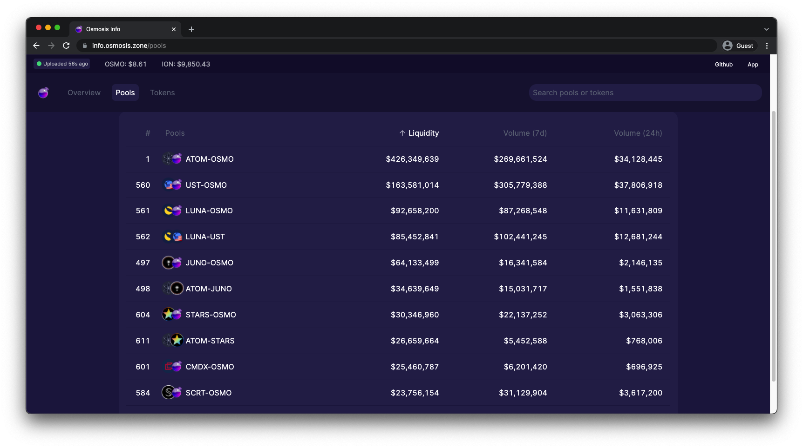

# Airdrop Guide

## Overview

As more chains enter the cosmos ecosystem, more projects may desire to airdrop their tokens to osmosis accounts.

This document lays out the process of creating a state export to derive all osmosis account addresses that exists at a specified height. We will then show how to further filter this list to also airdrop to accounts providing liquidity to specific osmosis pools.

### Prerequisites
1. Know what height you want to take the snapshot at
2. Know the pool IDs if looking to airdrop to accounts LPing to specific pools
3. Run an osmosis node with enough state history to state export at the desired height


### Choosing a block height
The current Osmosis block height can be found on the [Mintscan blocks page.](https://www.mintscan.io/osmosis/blocks)To find the date/time of a specific block height in the past, type the desired block height in the Mintscan search bar and press enter. Here is the Mintscan block height page for block 2138101:


In this example, block height 2138101 happened on 25 November 2021 at 12:59:55AM local time.

### Choosing pool IDs
If your organization also wants to airdrop tokens to liquidity providers of specific osmosis pools, you must first determine the pool IDs of the pools in question. The easiest way to find the pool ID is to go to the [info.osmosis.zone pools page ](https://info.osmosis.zone/pools)and note the number in the furthest left column for all the desired pools. You will need these pool IDs later.




### Determine osmosis node type requirement
First, determine how far in the past the desired block height is from the current time. If the desired block height is within the last seven days, you can make the state export with a default snapshot node. Anything further in the past more than likely needs to be done by setting up a node with an archive snapshot.

In our example, block height 2138101 is many months in the past, so we must use an archive snapshot.


### Run an osmosis node
To set up either a default or archive node, either use the osmosis bash installer [located here](https://get.osmosis.zone/)OR follow the instructions step by step [starting here.](https://docs.osmosis.zone/developing/cli/install.html)Ensure you follow the instructions for mainnet and set up using either the archive or default snapshot as determined above. Do not use state sync for this situation.


### Install the daemon version corresponding to snapshot height
If you are looking to take a snapshot for a block height that occurred during a previously breaking major release (i.e v3.x, v4.x, v5.x, etc.), you must ensure your daemon is running that version before taking the state export. To see the block height for all major releases, go to [the history of changes page](https://docs.osmosis.zone/history-and-changes.html)and check the titles of all major releases. You will see the block height the upgrade took place in the title. In our example, we are taking a state export at block height 2138101. Since v4 released at block height 1314500 and v5 didn't release until block height 2383300, we must ensure the daemon is now running v4 before we take the state export. To change the daemon version (in this example to v4.0.0):

```sh
cd $HOME/osmosis
git checkout v4.0.0
make install
```

Then check the version

```sh
osmosisd version
```

Which in this example should output 4.0.0

To reiterate, if your snapshot is being taken on a more recent height where the daemon version is still current, this step will not be required and you can continue with the current daemon version.


### Take the state export (snapshot)
Ensure the daemon is not running in the background. Then, to take a state export at a specified height (in this example 2138101):

```sh
osmosisd export 2138101 > state_export.json
```

This process may take 15 minutes or more.

::: warning NOTE
Some cosmos sdk versions write to STDERR instead of STDOUT. If the above command does not work for you, try to replace the > with 2>
:::


### Export accounts in JSON format
Now that you have a state export file with the name `state_export.json`, the last step needed is to export the accounts and respective balances from the state export. To get all existing osmosis accounts on the height the state export was taken and write it to a file called `balances.json`:

```sh
osmosisd export-derive-balances state_export.json balances.json
```

If you want the export to display specific pool IDs each address address is taking part in (in this example pools 1, 3, 4, and 560):

```sh
osmosisd export-derive-balances state_export.json balances.json --breakdown-by-pool-ids 1,3,4,560
```

You will now have a snapshot in json format of all addresses and their respective holdings you can use to assist you in your airdrop distribution!